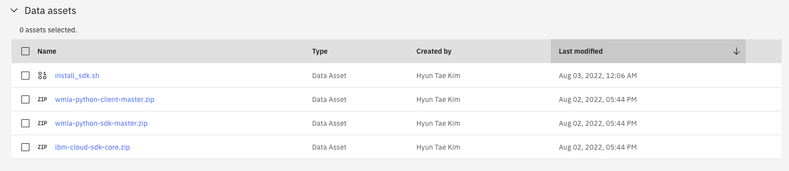
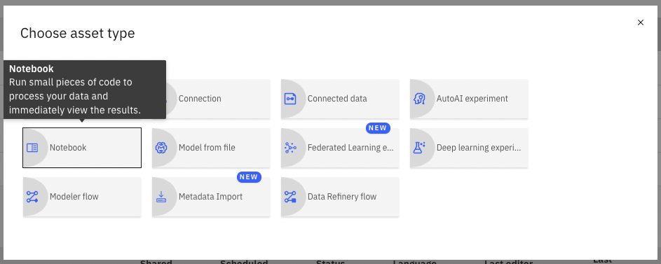

# wmla-python-client
A python based client to simplify using Watson Machine Learning Accelerator 

## Prerequisites

* Python 3.9 or above.
* [ibm_wmla](https://github.ibm.com/anz-tech-garage/wmla-python-sdk)
* ibm-cloud-sdk-core > 

## Installation (on CP4D enviroment)

Before installation, a user should add one bash script and three zip files to the project assets.

(in _examples/cp4d_ directory)
* install_sdk.sh

(in _examples/cp4d/install_files_ directory)
* ibm-cloud-sdk-core.zip
* wmla-python-client-master.zip
* wmla-python-sdk-master.zip

Add a new Jupyter Notebook to project

Detailed codes and more are found at install_python_client.ipynb.
The notebook contains 
(in _examples/cp4d_ directory)

<!-- 
## Examples

* A simple example to [verify the connection](examples/test_connection.py)
* A complete example for [uploading, deploying and starting a model](examples/test_model_upload.py) (documentation imcomplete, ask Sherry for details) -->